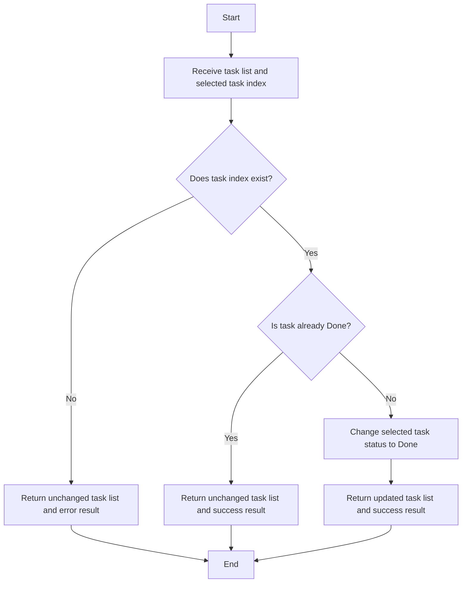

# Flow: Mark Task as Completed

```mermaid
flowchart TD
    A[Start] --> B[Receive task list and selected task index]
    B --> C{Does task index exist?}
    C -- No --> D[Return unchanged task list and error result]
    C -- Yes --> E{Is task already Done?}
    E -- Yes --> F[Return unchanged task list and success result]
    E -- No --> G[Change selected task status to Done]
    G --> H[Return updated task list and success result]
    D --> I[End]
    F --> I
    H --> I
```
