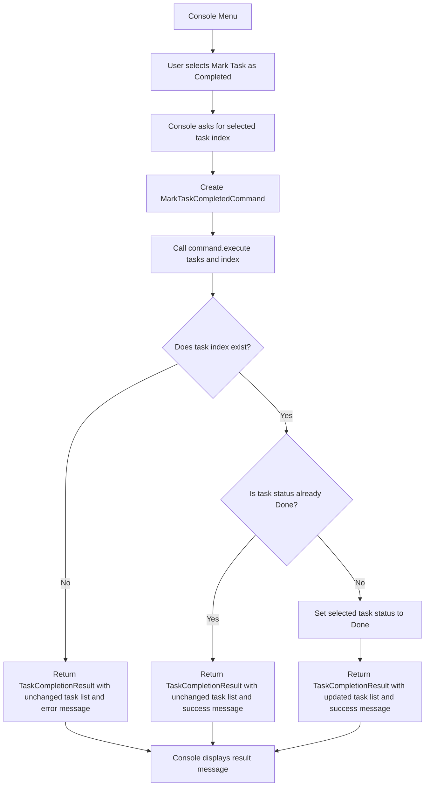

# Flow: Mark Task as Completed Using Command Pattern

```mermaid
flowchart TD
    A[Console Menu] --> B[User selects Mark Task as Completed]
    B --> C[Console asks for selected task index]
    C --> D[Create MarkTaskCompletedCommand]
    D --> E[Call command.execute tasks and index]

    E --> F{Does task index exist?}
    F -- No --> G[Return TaskCompletionResult with unchanged task list and error message]
    F -- Yes --> H{Is task status already Done?}

    H -- Yes --> I[Return TaskCompletionResult with unchanged task list and success message]
    H -- No --> J[Set selected task status to Done]
    J --> K[Return TaskCompletionResult with updated task list and success message]

    G --> L[Console displays result message]
    I --> L
    K --> L
```
